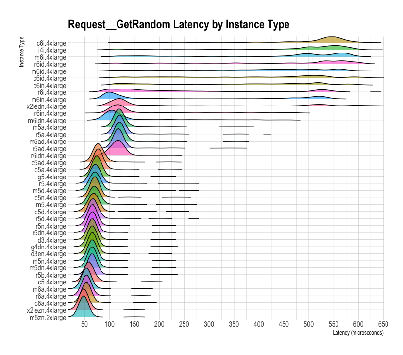
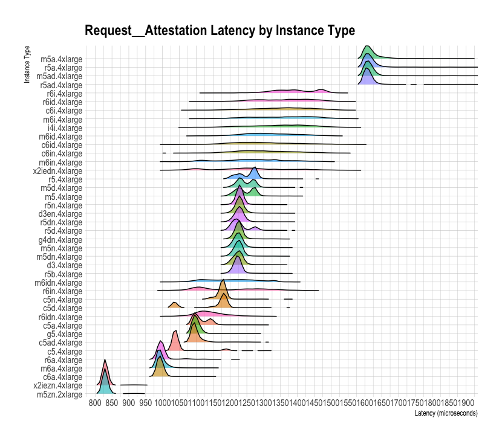

# AWS Nitro Security Module Benchmarking

This repository contains some simple benchmarks for the performance of [AWS Nitro
Enclave](https://aws.amazon.com/ec2/nitro/nitro-enclaves/) hypervisor operations,
namely those through the Nitro Secure Module which is available within an enclave as
`/dev/nsm`.  AWS provides a Rust driver for interacting with `/dev/nsm`
[here](https://github.com/aws/aws-nitro-enclaves-nsm-api) and a C driver
[here](https://github.com/aws/aws-nitro-enclaves-sdk-c).  The drivers interact with
`/dev/nsm` by making `ioctl()` system calls.

The benchmarks in this repository are interested in performance, particularly for
operations that might impact application scalability such as obtaining an attestation
document and requesting entropy.

All `ioctl()` call to `/dev/nsm` accept [CBOR](https://cbor.io/) encoded requests and
return CBOR responses.  Encoding and decoding are performed within the driver.  Some
benchmark results below include this encoding/decoding on the critical path, though
it's minimal when compared with the I/O time.

## Benchmarks

The following benchmarks are included in the suite.

 * [`Request::Attestation`](benches/nsm.rs) - attestation flow (including CBOR encoding).

   * Benchmarked for variable size `nonce` of random length (4, 8, 16, 32, 64, 128, 256,
     and 512 bytes).
   * Always an empty `public_key`.
   * Always a `user_data` string of "nttp".

 * [`Request::GetRandom`](benches/nsm.rs) - sourcing entropy from the enclave (including
   CBOR encoding).

   * Non-parameterized request for entropy.

 * [`Request::Attestation ioctl`](benches/nsm_ioctl.rs) - attestation flow (including only
   the `ioctl()` call).

   * Same parameters as `Request::Attestation` above.

All benchmarking was done in the us-east-1 region around May 2023.  We ran benchmarks on
mostly `*.4xlarge` instance types because these provided sufficient RAM and CPU to launch
an enclave and are widely available across different CPU generations.

## Results

We noticed variability of I/O latency by instance type suggesting that different instance
types use different underlying NSM device implementations.  Performance differences
were visible in both `Request::GetRandom` and `Request::Attestation`, with far more
pronounced performance differences for `Request::Attestation` (in addition to expectedly
slower performance).  Notably the standard deviation of some instance types is much
larger than others.



Instances with Intel chips (`*i`, `*in`, and `*id`) have notably poor performance,
considering both standard deviation and latency.  The `x2iezn` and `m5zn` instance types
have notably good performance across both measures.



## Development notes

### Running benchmarks

#### Locally (very fake)

Create a very fake `/dev/nsm` that doesn't do anything but allows the system
calls in the benchmark to succeed.  This allows for primitive local testing
with bogus results.

```
sudo ./tools/fake_nsm.sh
```

Run the benchmarks with `cargo criterion`, `cargo bench`, or
`./tools/run_benchmarks.sh`.  The bash script will generate individual JSON
output files for each benchmark.

Results are in `./target/criterion`.  These results are very fake.

#### On AWS

Launch EC2 instances configured in `main.tf`.
`terraform apply`

Wait for machines to shutdown.  Copy results down locally.
`aws s3 sync s3://nsm-benchmark-results/ ./`

Destroy EC2 instances with Terraform.

SSH is available to the instances (port 22) and enclave (port 2222).  SSH keys
are configured in Terraform.

### Other Notes

https://www.kernel.org/doc/Documentation/admin-guide/devices.txt

`/dev/nsm` is exposed as a char device (10).

```
-bash-4.2# ls -al /dev/nsm
crw-rw-rw- 1 root root 10, 147 Apr 20 14:13 /dev/nsm
```

Does not appear to use `read()` or `write()` -- only `ioctl()`.
